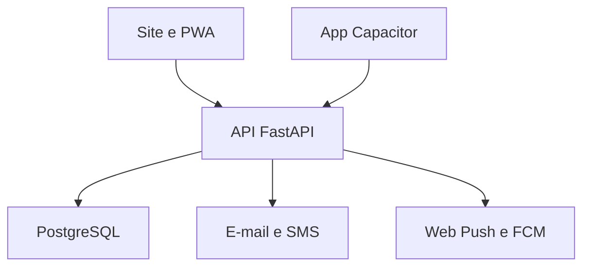

# Arquitetura web, PWA e aplicativos

## Decisão

A interface atual será mantida em HTML, CSS e JavaScript. Ela vira uma PWA instalável e, depois,
um projeto Capacitor para as lojas. FastAPI centraliza autenticação, dados e sincronização.

| Camada | Tecnologia | Motivo |
|---|---|---|
| Interface | projeto web atual | preserva o visual e as funções já feitas |
| PWA | manifest + service worker | instalação imediata no celular e tablet |
| App de loja | Capacitor | reutiliza a interface e permite APIs nativas |
| Backend | Python + FastAPI | API rápida, tipada e com documentação automática |
| Persistência | PostgreSQL | contas, sincronização e integridade em produção |

## Autenticação por cliente

No site/PWA, o access token fica apenas na memória e o refresh token fica em cookie HttpOnly. O
site publicado deve encaminhar `/api` para o backend no mesmo domínio.

Para os pacotes nativos, a etapa do Capacitor ganhará um adaptador próprio: refresh token no
Keychain do iOS ou Keystore do Android e troca via HTTPS. Isso evita depender do comportamento de
cookies entre WebView e API, que varia por sistema operacional.

O Google OAuth abre no navegador do sistema. O backend valida `state`, `nonce`, PKCE, assinatura e
claims do ID token; depois retorna ao site ou ao deep link nativo com um código opaco de uso único.
Tokens de sessão nunca percorrem a URL.

Alterações offline ficam em IndexedDB, separadas por usuário e executadas em ordem. Os POSTs usam
UUID criado no dispositivo, então uma repetição após perda de resposta retorna o mesmo registro. O
controle de versão do backend sinaliza conflitos em vez de sobrescrever silenciosamente outro
dispositivo.

As notificações seguem dois canais: Web Push no navegador/service worker e FCM no pacote
Capacitor. O backend guarda apenas endpoint/chaves públicas ou token do dispositivo, nunca a chave
privada do Firebase no cliente. No logout completo, o registro do dispositivo é desativado.

## O que não deve ser feito

- colocar a senha, o refresh token ou o segredo JWT no `localStorage`;
- reutilizar SQLite na hospedagem com múltiplas instâncias;
- publicar o modo `debug_code`;
- ativar Google sem validar `state`, `nonce`, redirecionamentos e vínculo de contas no servidor;
- considerar o protótipo local como banco definitivo dos usuários.
